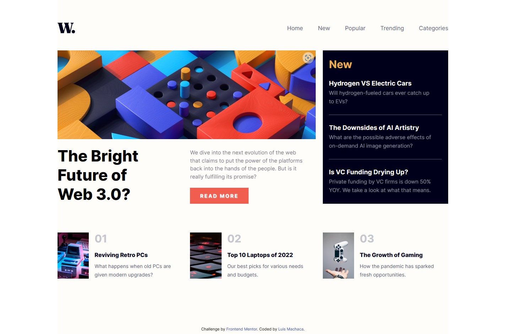
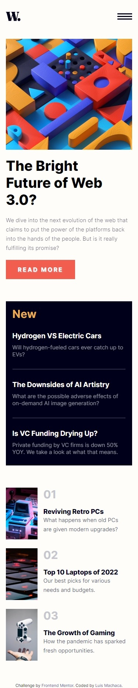
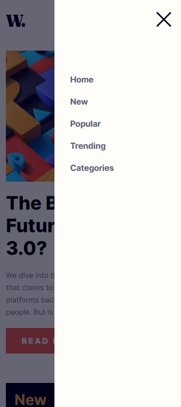

# Frontend Mentor - News homepage solution

This is a solution to the [News homepage challenge on Frontend Mentor](https://www.frontendmentor.io/challenges/news-homepage-H6SWTa1MFl). Frontend Mentor challenges help you improve your coding skills by building realistic projects.

## Table of contents

- [Overview](#overview)
  - [The challenge](#the-challenge)
  - [Screenshot](#screenshot)
  - [Links](#links)
- [My process](#my-process)
  - [Built with](#built-with)
  - [What I learned](#what-i-learned)
  - [Continued development](#continued-development)
  - [Useful resources](#useful-resources)
- [Author](#author)

## Overview

### The challenge

Users should be able to:

- View the optimal layout for the interface depending on their device's screen size
- See hover and focus states for all interactive elements on the page

### Screenshot





### Links

- Solution URL: [solution URL](https://your-solution-url.com)
- Live Site URL: [live site URL](https://your-live-site-url.com)

## My process

### Built with

- Semantic HTML5 markup
- CSS custom properties
- Flexbox
- CSS Grid
- Mobile-first workflow
- javascript
- BEM Naming

### What I learned

The tag structure of the Navigation Mobile component is as follows

```html
  <div class="nav__mobile">
    
    <div class="nav__column">
      <ul class="menu">
        <li class="menu__item">
          <a class="menu__link" href="#">Home</a>
        </li>
        <li class="menu__item">
          <a class="menu__link" href="#">New</a>
        </li>
        <li class="menu__item">
          <a class="menu__link" href="#">Popular</a>
        </li>
        <li class="menu__item">
          <a class="menu__link" href="#">Trending</a>
        </li>
        <li class="menu__item">
          <a class="menu__link" href="#">Categories</a>
        </li>
      </ul>
    </div>
  </div>
```

Here we can see the styles that are added to show and hide navigation on mobile devices.

```css
.nav__mobile {
  opacity: 0;
  pointer-events: none;
  position: fixed;
  top: 0;
  left: 0;
  width: 100vw;
  height: 100vh;
  background-color: var(--very-dark-blue-transparency);
  z-index: 2;
  transition: opacity 0.6s ease-out;
}
.nav__mobile--visible {
  opacity: 1;
  pointer-events: auto;
}
```

When we click on the menu icon we add the appropriate class to make visible the navigation links that were hidden and click on the close icon to hide the navigation again.

```js
  const iconMenu = document.querySelector(".menu-icon"),
  iconClose = document.querySelector(".icon-close"),
  navMobile = document.querySelector(".nav__mobile");

iconMenu.addEventListener("click", () => {
  navMobile.classList.add("nav__mobile--visible");
});

iconClose.addEventListener("click", () => {
  navMobile.classList.remove("nav__mobile--visible");
});

```

### Continued development

Maybe I would need to improve the handling of grid in CSS and be able to make spacings of text and sections a little more precise and consistent. But in general I had a lot of fun doing this challenge because I could reinforce CSS grid and combine with flexbox.también using the opacity property instead of the none value of the display property to hide the mobile navigation, as it is an animatable (that can be animated) property allowed me to use transitions.

### Useful resources

- [grid-css](https://developer.mozilla.org/en-US/docs/Web/CSS/grid) - this resource helped me to review concepts and apply them to the to the main news content.
- [transition-css](https://developer.mozilla.org/en-US/docs/Web/CSS/CSS_Transitions/Using_CSS_transitions) - this resource helped me to review concepts and apply them to the challenge.
- [opacity-css](https://developer.mozilla.org/en-US/docs/Web/CSS/opacity)  -this resource helped me to be able to hide the navigation element in mobile devices
- [pointer-events](https://developer.mozilla.org/en-US/docs/Web/CSS/pointer-events)-this resource helped me to be able to handle when a graphic element  can be target of the events of pointers.
- [Animatable-property](https://developer.mozilla.org/en-US/docs/Web/CSS/CSS_animated_properties)-This MDN resource helped me know which CSS properties are animatable (that can be animated).

## Author

- Linkedin - [luismachaca](https://www.linkedin.com/in/luismachaca)
- Frontend Mentor - [@luismacode](https://www.frontendmentor.io/profile/luismacode)
- Twitter - [@luismacode](https://www.twitter.com/luismacode)
